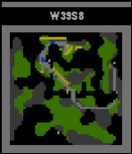

# Pcreeps

Pebble watch app for the [screeps](https://screeps.com/) MMORTS programming
game.



Logs into your account, grabs list of rooms you own, and displays the minimap
similar to the worldview in the web app. Has a few differences from the
normal world view:

 * Creeps are blue, as they are too hard to see otherwise.
 * There are a lot more colors (and more coming) than the normal world map.
   Energy structures are either yellow or brown, some things are
   gray/brown/etc. You can watch as spawns pull energy and haulers restore
   energy.

Plays an animation of 20 recentish ticks when the select button is pushed.

Switches room views when the up/down buttons are pushed.

Presently a very simple app, but it won't/can't get much more complex.

## Compatibility

Works on color Pebbles only. Currently tested on pebble time and pebble time
steel. Should soon have support for pebble time round once I get a little time
to test and tweak it.

# Installing

You'll need to do the usual pebble setup at https://developer.pebble.com/ -
grab SDK 3.x or higher.

```
pebble package install pebble-clay
pebble package install pebble-gbitmap-lib
```

and then `pebble install --phone etc`.

Not an easy process. If you would like to easily run this on your watch,
*please* give me a ping and I'll invest the time getting it up on the store if
possible.

## TODO:

 * Golf the memory usage down. There's no point since there's plenty of free
   memory, but I can at least halve the image size by using a 4bit palette.
   Can also split the transfer messages to avoid 2500 bytes of statically
   allocated inbox buffer and scale the final image directly into the framebuffer
   instead of an intermediary bitmap. The latter will save a *lot* of memory.

 * Golf the battery usage a bit more. Sends an individual message per frame,
   but does it use less battery to send fewer messages?

 * Watchface mode where it updates the room every N minutes.

 * Double-press select to see some room info.

 * Display GCL+progress somewhere? Could just be a bar below the text.

 * Up/Down bring up a scrollback of roomnames for fast-switching.

 * Config item for a default room name to show?

 * Improve colors more.

 * I dunno? Could actually send notifs to the watch if you get inbox messages,
   attacks, etc.

Since this is a side project don't expect these things to happen quickly. Will
do one or two every so often so long as the game holds my interest.
